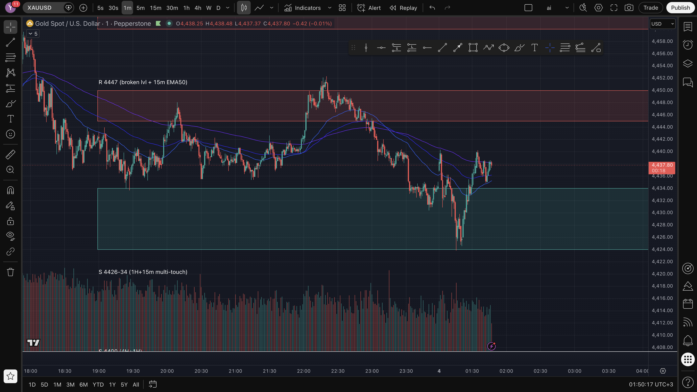

# Trade: LONG_4429_TP2_jun3

| Field | Value |
|---|---|
| Side | **LONG** |
| Entry | 4428.83 |
| Stop Loss | 4425.33  (~35p risk) |
| TP1 | 4433.83  (+50p) |
| TP2 | 4438.83  (+100p) |
| Grade | A+ (auto) |
| Pattern/Setup | resistance-trendline break + A+ bounce at 4426-34 support |
| Price at journaling | 4438.79 |

## Chart (analysed TF)

## Timeframe analysis — what each TF showed that allowed the entry
| TF | Read |
|---|---|
| **Daily** |  |
| **4H** |  |
| **1H** | at strong 1H+15m support 4426-34 |
| **15m** | double-bottom / bounce |
| **1m (entry/confirm)** | res-trendline break = momentum turned up |

## Why we entered
Auto-signal A+: LONG bounce off the 4426-34 multi-touch HTF support, confirmed by a resistance-trendline break (momentum flipping up). With the zone, not against it — the high-quality setup.

## Why this ENTRY
(entry rationale captured in reason above)

## Why this STOP LOSS
SL at 4425.33: placed beyond the level/structure that invalidates the thesis. Risk ~35 pips.

## Why these TARGETS
TP1 4433.83 (+50p) = first structure/partial; TP2 4438.83 (+100p) = next swing/extension.

## Management rule
Take partial at TP1, move stop to breakeven, trail the runner. Quick-scalp: if TP1 not hit within ~10 min, exit.

## OUTCOME
WIN +100 pips (+$100)! TP2 hit — bounced off 4426-34 support and ran full target. The A+ at-zone setup paid in full.
