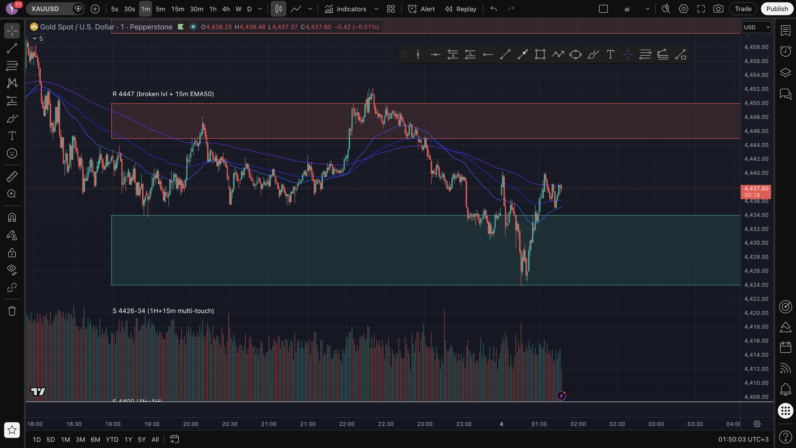

# Trade: SHORT_4425_SL_jun3

| Field | Value |
|---|---|
| Side | **SHORT** |
| Entry | 4425.15 |
| Stop Loss | 4428.65  (~35p risk) |
| TP1 | 4420.15  (+50p) |
| TP2 | 4415.15  (+100p) |
| Grade | A (auto) |
| Pattern/Setup | momentum impulse — SHORT into the 4426-34 support |
| Price at journaling | 4438.62 |

## Chart (analysed TF)

## Timeframe analysis — what each TF showed that allowed the entry
| TF | Read |
|---|---|
| **Daily** |  |
| **4H** |  |
| **1H** | below EMAs (bearish) but at the 1H+15m 4426-34 support |
| **15m** | at multi-touch support |
| **1m (entry/confirm)** | momentum-impulse down INTO support — fragile |

## Why we entered
Auto-signal: momentum-impulse short fired AT the 4426-34 support zone (shorting INTO support = low quality). The zone held and bounced — stopped out. Key lesson: down-weight momentum-impulse triggers that fire counter to a fresh HTF zone.

## Why this ENTRY
(entry rationale captured in reason above)

## Why this STOP LOSS
SL at 4428.65: placed beyond the level/structure that invalidates the thesis. Risk ~35 pips.

## Why these TARGETS
TP1 4420.15 (+50p) = first structure/partial; TP2 4415.15 (+100p) = next swing/extension.

## Management rule
Take partial at TP1, move stop to breakeven, trail the runner. Quick-scalp: if TP1 not hit within ~10 min, exit.

## OUTCOME
LOSS −35 pips (−$35). SL hit. Shorted into support; it held. (loser #1 of daily 2)
