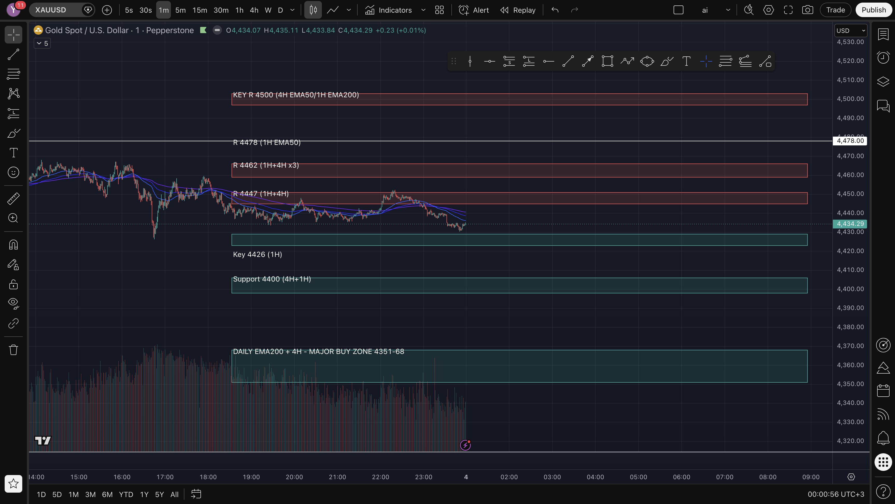

# Trade: SHORT_4443_jun3

| Field | Value |
|---|---|
| Side | **SHORT** |
| Entry | 4443 |
| Stop Loss | 4448  (~50p risk) |
| TP1 | 4438  (+50p) |
| TP2 | 4433  (+100p) |
| Grade | with-trend (A-) |
| Pattern/Setup | R 4447 (1H+4H) resistance rejection + support-trendline-break momentum |
| Price at journaling | 4434.29 |

## Chart (analysed TF)

## Timeframe analysis — what each TF showed that allowed the entry
| TF | Read |
|---|---|
| **Daily** | Broad uptrend but in a deep correction: price between Daily EMA50 (~4630) and Daily EMA200 (~4357) — i.e. above major support but medium-term pulling back. Not at the premium buy zone, so no long bias; pullback favours shorts intraday. |
| **4H** | Bearish: price below 4H EMA50 (~4499) and EMA200 (~4580); clear series of lower highs. Trading under broken structure → with-trend = short. |
| **1H** | Bearish: below 1H EMA50/200; sitting at R 4447, a multi-touch 1H+4H level (support->resistance flip). Lower highs intact. |
| **15m** | Structure rolling over off the 4447 resistance; momentum turning down — confirmed the short side. |
| **1m (entry/confirm)** | Execution: bearish rejection candle at 4447 + support-trendline break (strong red bar). Entered ~4443; downside follow-through validated it. |

## Why we entered
With-trend short into a multi-TF resistance. Price rallied into R 4447 (a 1H+4H multi-touch level that had flipped from support to resistance) and rejected; entered the rollover ~4443 with the 1m support-trendline break confirming downside momentum and volatility back >40p/10bars.

## Why this ENTRY
(entry rationale captured in reason above)

## Why this STOP LOSS
SL at 4448: placed beyond the level/structure that invalidates the thesis. Risk ~50 pips.

## Why these TARGETS
TP1 4438 (+50p) = first structure/partial; TP2 4433 (+100p) = next swing/extension.

## Management rule
Take partial at TP1, move stop to breakeven, trail the runner. Quick-scalp: if TP1 not hit within ~10 min, exit.

## OUTCOME
WIN +50 pips (+$50). Exit 4438 = TP1 hit. After an initial retest of 4447 tested the entry, price rolled over with the trendline-break momentum to TP1. Took the +50/TP1 scalp exit rather than holding for TP2 — clean, disciplined.
